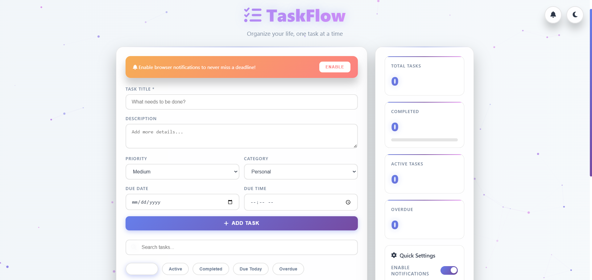
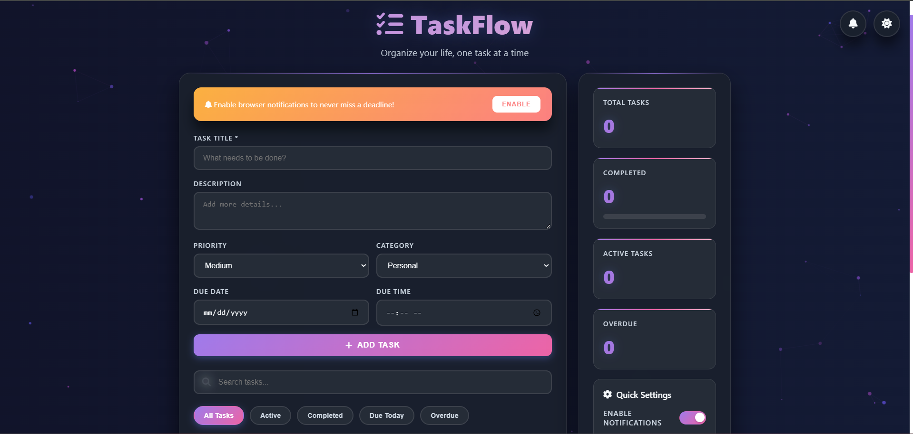

# 🧠 TaskFlow – Modern To-Do List with Particle Effects

TaskFlow is a beautifully designed **productivity and task management app** built with pure HTML, CSS, and JavaScript — featuring **live particle backgrounds, dark mode, sound alerts, and rich notifications**.  
Stay organized, track progress, and boost productivity — all in one elegant interface.

---

## 🚀 Live Demo
🔗 **View Live:** [Click Here to Try TaskFlow](https://nitesh-shaw-098.github.io/TaskFlow/)

---

## ✨ Features

✅ **Modern UI** – Beautiful glassmorphism design with animated gradient background.  
✅ **Dark / Light Mode** – Instantly switch between light and dark themes.  
✅ **Smart Notifications** – Get alerts for upcoming, due, and overdue tasks.  
✅ **Sound Effects** – Different sounds for success, warning, and error actions.  
✅ **Quick Filters** – View all, active, completed, overdue, or today’s tasks.  
✅ **Task Categories & Priorities** – Organize your life better with multiple tags.  
✅ **Draggable Task Items** – Reorder tasks easily.  
✅ **Daily Summary** – Optional morning summary notification.  
✅ **Responsive Design** – Works smoothly on all devices.

---

## 🛠️ Technologies Used

- **HTML5**
- **CSS3 (Custom Properties, Animations, Flex/Grid)**
- **Vanilla JavaScript (ES6+)**
- **Font Awesome Icons**
- **LocalStorage API** for saving tasks
- **Web Notifications API**
- **Canvas API** for dynamic background particles

---

## ⚙️ Setup Instructions

1. **Clone this Repository**
   ```bash
   git clone https://github.com/yourusername/taskflow.git
---

2. **Open the Project**

   ```bash
   cd taskflow
   ```

3. **Run Locally**
   Just open `index.html` in your browser — no setup required.

4. **Deploy Online**

   * Upload the folder to [**Netlify**](https://www.netlify.com/), [**Vercel**](https://vercel.com/), or enable **GitHub Pages**.
   * Once deployed, replace the demo link in this README with your live URL.

---

## 📸 Preview

| Light Mode                                  | Dark Mode                                 |
| ------------------------------------------- | ----------------------------------------- |
|  |  |

---

## 💡 How It Works

* Tasks are stored in your browser’s **LocalStorage**, so your data stays saved even after refresh.
* The **Particle Canvas** uses JavaScript to render interactive floating effects.
* Notifications are powered by the **Web Notification API** — grant permission to enable them.
* Toggle switches and sliders manage your preferences instantly.

---

## 🧑‍💻 Developer Info

**Author:** Shaw Nitesh

**GitHub:** [@nitesh-shaw-098](https://github.com/nitesh-shaw-098)

**Email:** [niteshshaw032002@email.com](mailto:niteshshaw032002@email.com)

---

## 🪄 License

This project is licensed under the **MIT License** — free to use and modify with attribution.

---

### ⭐ Don’t forget to star this repo if you like it!
